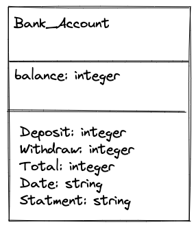

# Bank

A bank statment tech test. 

## Specification

Requirements
 - You should be able to interact with your code via a REPL like IRB or Node. (You don't need to implement a command line interface that takes input from STDIN.)
 - Deposits, withdrawal.
 - Account statement (date, amount, balance) printing.
 - Data can be kept in memory (it doesn't need to be stored to a database or anything).

Acceptance criteria
 - Given a client makes a deposit of 1000 on 10-01-2023
 - And a deposit of 2000 on 13-01-2023
 - And a withdrawal of 500 on 14-01-2023
 - When she prints her bank statement
 - Then she would see:

 date || credit || debit || balance\
14/01/2023 || || 500.00 || 2500.00\
13/01/2023 || 2000.00 || || 3000.00\
10/01/2023 || 1000.00 || || 1000.00

## User Stories

```
As a client,
So that I can have money in my bank account,
I want to be able to make a deposit.

As a client,
So that I can access my money,
I want to be able to withdraw it.

As a client,
So I know when I did what,
I want to be able to see the date I made a transaction.

As a client,
So I can keep trck of what I've done and when,
I want to see my bank statment printed. 
```
## Domain Moddles



## Setting the program up
 
 Fork and then clone this repositry
 install any gems by running the following code: 
 ```
 bundle 
```
## To use the program
 - Make sure gems are installs (follow steps above)
 - Open irb
 - Call the file 